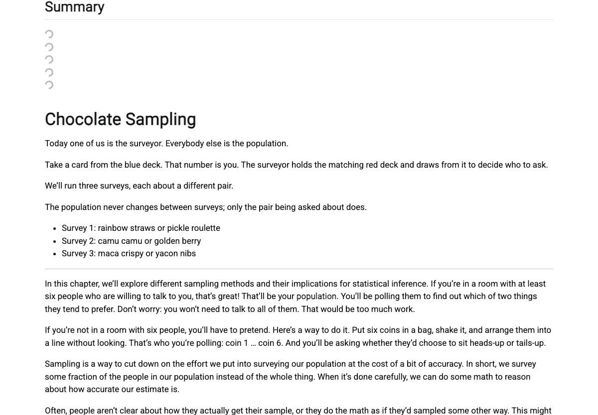
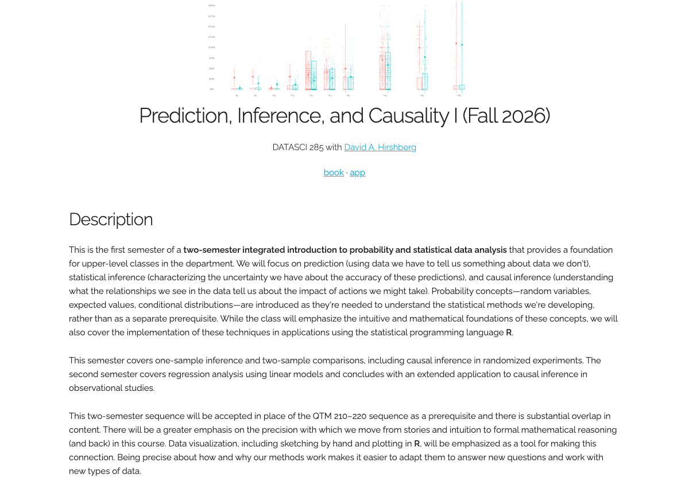
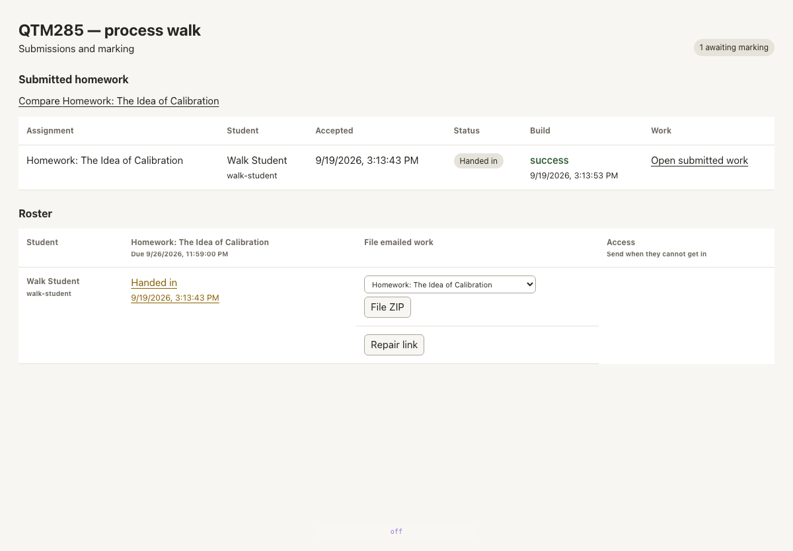

# The teaching loop

One pass through the whole process, walked on 2026-09-19 against the running
system. Every number on this page was measured on that walk; every screen is a
capture of the real surface, not a drawing of one.

The walk ran on a copy of the live course — the source tree of `qtm285-book`
cloned to its own project, its own course, its own assignment, its own student.
Same code, same server, same build executor, same publish path.

---

## Beat 1 — He edits a chapter

**On screen.** The chapter source in his editor, on disk, in the course repo.

**What he does.** Adds a sentence to `chapters/chapter-sampling.qmd`.

    @@ -37,2 +37,4 @@ We'll run three surveys, each about a different pair.

    +The population never changes between surveys; only the pair being asked about does.
    +
     - Survey 1: `r A1` or `r B1`

**What changes.** One file on disk. Nothing else yet.

---

## Beat 2 — It builds

**On screen.** The terminal, briefly, then nothing to watch.

**What he does.** Nothing. The push is the whole action.

    $ tlda project push
    Source submitted.

      push returned              4 seconds
      rebuild settled           79 seconds

**What changes.** The submitted revision becomes the built book. Seventy-nine
seconds from a saved file to a rebuilt chapter — the first build of a project
is a cold full render and takes minutes, but this is the loop he is actually in.

---

## Beat 3 — He sees it

**On screen.** The rebuilt chapter, with the new sentence in place, the R code
around it evaluated — `rainbow straws`, `pickle roulette` are computed values,
not typed ones.

**What changes.** The sentence he typed is in the book, in position, rendered.

**Space.** Same chapter, same scroll position he was reading.

---

## Beat 4 — It publishes

<!-- HELD pending Skip's ruling. DO NOT PUBLISH THIS BEAT AS IT STANDS.

     What I had written — "publishing is a consequence of the build" — is FALSE.
     There is no path from a render to his site except a person deciding to
     push. `qtm285.github.io/static/book/` is a wholesale copytree of `_book`
     committed into a Pages repo by hand.

     The numbers I had here (33 pages / 6 decks) were my copy's BUILD, not a
     publication, and are the stage error I retracted.

     `tlda project publish` exists and has never been pointed at his class
     site; pointing it there today would send 20 html against the 37 live.
     Which of those two is "his book" is the ruling in flight. Write this beat
     when it lands. -->

---

## Beat 5 — Students see it

**On screen.** The class site. Title, the figure, the description, and the two
doors in: **book** and **app**.

**What they do.** Click through to a chapter, or download the homework zip.

      links on the page          27
      resolving                  26
      the one that does not      the `app` route, which a static publish has no page for

**Space.** New frame. This is the first screen that is not his.

---

## Beat 6 — They hand in

**On screen.** Positron, the editor the class works in. **View → Command
Palette → Homework: Submit.**

**What happens.** The command reads the server and assignment out of the
homework's own front matter, zips the assignment folder, and posts it.

    SERVER ACCEPTED
      assignment      walk-calibration
      student         walk-student
      answers parsed  13
      build           success, 22 seconds later

**What changes.** Their work becomes a rendered document on the server, keyed to
the thirteen answer blocks they filled in. No upload page, no attachment, no
email.

---

## Beat 7 — He marks

**On screen, first.** The gradebook. Every hand-in, whether it built, and the
way in.

**What he does.** Opens the submitted work.

<!-- NOT CAPTURED YET — DO NOT PUBLISH THIS BEAT AS IT STANDS.
     The marking screen must be the solution chapter in the ordinary flow:
     solution full width, the student's answer in the margin, buttons in the
     header. Skip, 15:19. The capture I had (img/07-marking.png) was
     ?workspace=classroom-problems — the standalone mode he killed — and showed
     no solution callout, no student answer and no margin. It has been removed
     rather than re-captioned.
     Blocked on grading-2 landing the gradebook ruling, and the image must
     contain a visible mark. -->

---

## Beat 8 — They get it back

**On screen.** One button, in the header.

<!-- NOT CAPTURED YET — AND THE EVIDENCE I HAD PROVED THE OPPOSITE.
     `returned at 2026-09-19T19:26:23Z` is NOT evidence the student received
     marks. Return without a problem id skips copying the marking layer, still
     marks the submission returned, and still answers 200 — so that timestamp is
     the symptom of the bug, printed as proof the bug did not happen.
     Blocked on c41b25e8a being deployed, and on someone seeing marks actually
     arrive on the student's side. -->

---

## What this page is

An acceptance test with pictures. It exists because the loop ran end to end on
the date above; each beat was performed, not described.
